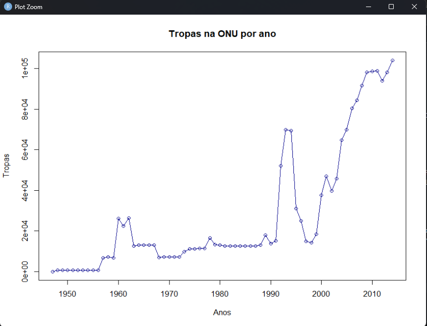
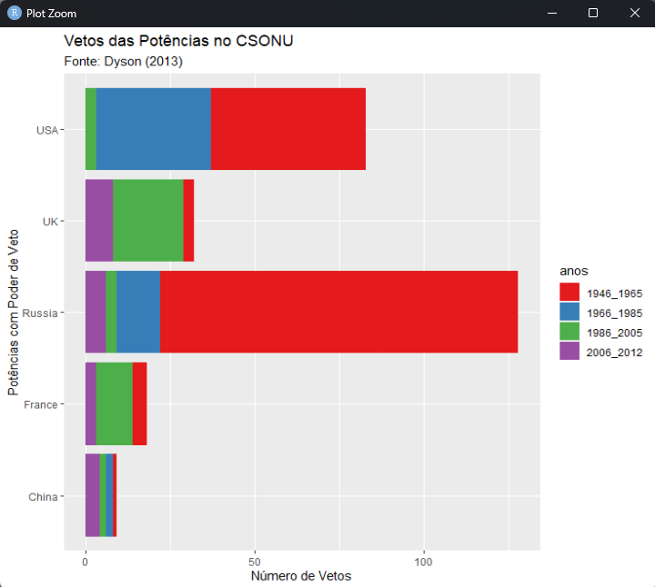
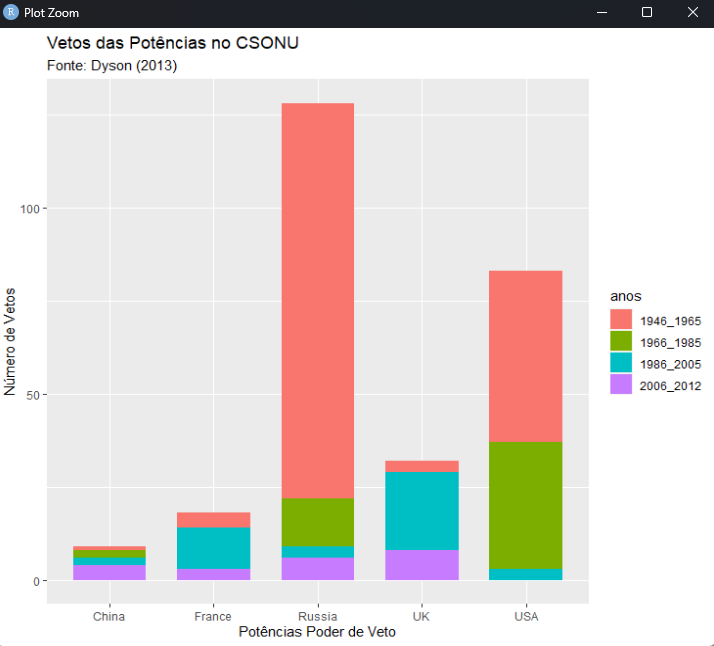
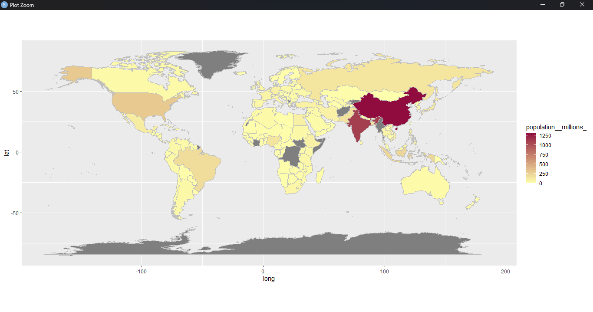

**Author:** [Alex Bruno de Oliveira](http://alexbrunoliveira.com/) 


# Curso de Política Internacional usando R

Este repositório contém materiais e exemplos de análises de dados de Política Internacional usando a linguagem de programação R. O objetivo deste curso é fornecer uma introdução prática ao uso do R para analisar questões relacionadas à Política Internacional, com foco em conflitos e guerras.

## Conteúdo do Curso

O curso está dividido em várias seções, abordando tópicos como:

1. Introdução ao R e configuração do ambiente de trabalho.
2. Aquisição e manipulação de dados sobre conflitos e guerras.
3. Visualização de dados para compreender tendências históricas.
4. Análise de redes de alianças políticas.
5. Modelagem estatística para prever conflitos futuros.

## Pré-requisitos

Antes de começar este curso, é aconselhável ter conhecimento básico em Política Internacional e estar familiarizado com os conceitos básicos de estatística. Além disso, é necessário ter o R instalado em seu sistema. Se você ainda não o tem, você pode baixá-lo em [R Project](https://www.r-project.org/).

## Como Usar Este Repositório

Este repositório contém os seguintes diretórios e arquivos:

- `data/`: Este diretório contém os dados brutos usados nos exemplos.
- `scripts/`: Aqui você encontrará os scripts R usados para realizar análises de dados.
- `README.md`: Este arquivo.

## Exemplo de Análise: Tendências de Guerras no Século XX

Neste curso, exploramos uma análise de dados históricos de conflitos e guerras no século XX usando R. Veja um exemplo de como analisamos e visualizamos tendências:


<p align="center">
  
  </p>

  #### Comando que apresenta dados em gráfico de pizza 
  ### A soma dos países permanentes e provisórios de cada país do CSONU
  ```
  pie(t, main="Gr?fico Etapa 6 - Poder no CSONU",labels=rotulos, col=rainbow(2), sub="Fonte: COW (2021)", cex.main=1.0, cex.sub=0.5, col.main="darkblue", radius=1.0)
```
<p align="center">
  
  </p>
Este gráfico mostra a tendência de guerras ao longo do século XX com base em dados de várias fontes. Podemos observar um aumento significativo no número de conflitos após a Segunda Guerra Mundial, seguido por uma tendência decrescente nas décadas seguintes.

## Gráfico em linha do tipo "o" linhas e pontos
#### Nessa etapa a base de dados “tropas_ONU”, que reúne duas variáveis, o ano e a quantidade de tropas enviadas pelos países para as missões de paz da ONU. A base vai de 1947 até 2014


  ```
  plot(ano, tropas,type = "o", col = "darkblue", xlab = "Anos", ylab = "Tropas",main = "Tropas na ONU por ano")
```
<p align="center">
  
  </p>

  ## Gráfico de barras Horizontal
  #### Tragetória dos vetos da ONU ao longo das décadas
  

  <p align="center">
  
  </p>

##### Codigo disponível no curso 
```

  install.packages("ggplot2")
library(ggplot2)

ggplot(vetos_CSONU, aes(fill=anos, y=pais, x=vetos)) + geom_bar(position="stack", stat="identity")+ 
  labs(title = "Vetos das Pot?ncias no CSONU ",
       subtitle = "Fonte: Dyson (2013)",
       x = "N?mero de Vetos",
       y = "Pot?ncias Poder de Veto")

```


 ##### Codigo alterado 
```

  install.packages("ggplot2")
library(ggplot2)

ggplot(vetos_CSONU, aes(fill = anos, y = pais, x = vetos)) +  geom_bar(position = "stack", stat = "identity") +
  labs(title = "Vetos das Potências no CSONU",
    subtitle = "Fonte: Dyson (2013)",
    x = "Número de Vetos",
    y = "Potências com Poder de Veto"
  ) +
  scale_fill_brewer(palette = "Set1")  # Define uma paleta de cores

```


  ## Gráfico de barras Vertical

   <p align="center">
  
  </p>

  ```
ggplot(vetos_CSONU, aes(fill = anos, x = vetos, y = pais)) +
  geom_bar(stat = "identity", position = "stack", width = 0.7) +
  labs(
    title = "Vetos das Potências no CSONU",
    subtitle = "Fonte: Dyson (2013)",
    x = "Número de Vetos",
    y = "Potências Poder de Veto"
  ) +
  coord_flip()  # Inverte os eixos x e y para criar um gráfico de barras empilhadas horizontal

  ```


   ## Países com maior número de habitantes segundo Bando de dados de Economia

 <p align="center">
  
  </p>


   ```
   econ1 <- subset(economia, select=c(country, population__millions_)) #separando paises e imposto de resda com subset# 
world2  = map_data("world")   #invocando dados do mapa e o nome dado fo objeto foi world#
world2 <- merge (world, econ, by.x="region", by.y="country", all.x=T, all.y=F) #objeto c nome wordl1 com merge q junta o bc com regiao, pais e imposto de renda e all.y=f para o bd nao vir com outras variaveis#
world2 <- world[order(world1$order),] #ordenando o objeto c uso do $ crescente#
m0 <- ggplot(data=world1) #cria plano de fundo para objeto world1#
m1 <- m0 + geom_polygon(aes(x=long, y=lat, group=group, fill= population__millions_)) + coord_equal() #somado os poligonos com ggplot#
m2 <- m1 + geom_path(aes(x=long, y=lat, group=group), color='grey', size=.1)
m3 <- m2 + scale_fill_gradient(low = "#ADD8E6", high = "#900C3F")
m3
   ```

## Contribuição

Se você deseja contribuir para este repositório com seus próprios exemplos de análise ou melhorias nos materiais existentes, sinta-se à vontade para abrir um pull request. Estamos abertos a colaborações!

## Contato

Se você tiver dúvidas, sugestões ou precisar de assistência, entre em contato conosco através das seguintes opções:

- Email: [alexbrunoliveira@gmail.com](alexbrunoliveira@gmail.com)
- Linkedin: [Alex bruno de Oliveira](https://www.linkedin.com/in/alex-bruno-junior-dev/)


